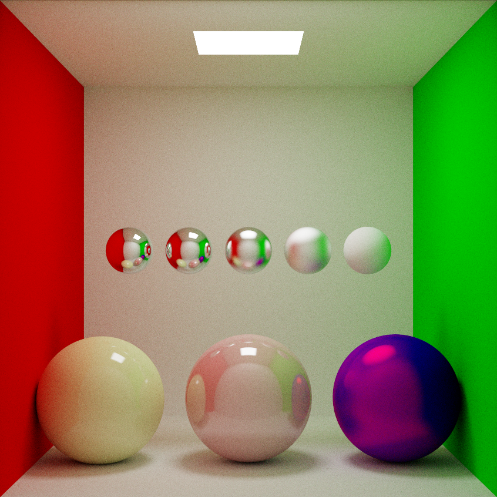

# glRays

A real-time and interactive Monte Carlo path tracer that renders on the GPU using GLSL compute shaders.

The application uses OpenGL along with the rather standard set of libraries [GLAD](https://github.com/Dav1dde/glad), [GLFW](https://github.com/glfw/glfw), [GLM](https://github.com/g-truc/glm), and [Dear ImGui](https://github.com/ocornut/imgui) to render the scene via a compute shader. It implements all of the standard lighting behaviours (diffuse reflections, specular reflections, refractions), and renders both sphere and triangle primitives.

# To-Do
- [x] Implement standard lighting behaviours
- [ ] Runtime mesh loading
- [ ] Use BVH acceleration structure
- [ ] Texture mapping
- [ ] Volume rendering (smoke, fog, etc.)
- [ ] Utilise DX12/Vulkan ray tracing hardware acceleration (not possible for now as I don't have an RTX card)